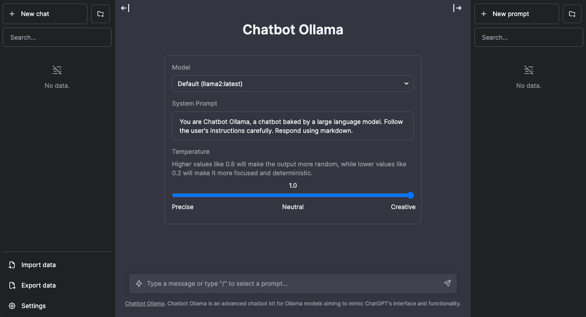

# Chatbot Ollama

## About

Chatbot Ollama is an open source chat UI for Ollama.

This project is based on [chatbot-ui](https://github.com/mckaywrigley/chatbot-ui) by [Mckay Wrigley](https://github.com/mckaywrigley).



## Updates

Chatbot Ollama will be updated over time.

### Next up

- [ ] pull a model
- [ ] delete a model
- [ ] show model information

## Docker

Build locally:

```shell
docker build -t chatbot-ollama .
docker run -p 3000:3000 chatbot-ollama
```

Pull from ghcr:

```bash
docker run -p 3000:3000 ghcr.io/ivanfioravanti/chatbot-ollama:main
```

## Running Locally

### 1. Clone Repo

```bash
git clone https://github.com/ivanfioravanti/chatbot-ollama.git
```

### 2. Move to folder

```bash
cd chatbot-ollama
```

### 3. Install Dependencies

```bash
npm ci
```

### 4. Run Ollama server

Either via the cli:

```bash
ollama serve
```

or via the [desktop client](https://ollama.ai/download)

### 5. Run App

```bash
npm run dev
```

### 6. Use It

You should be able to start chatting.

## Configuration

When deploying the application, the following environment variables can be set:

| Environment Variable              | Default value                  | Description                                                                                                                               |
| --------------------------------- | ------------------------------ | ----------------------------------------------------------------------------------------------------------------------------------------- |
| DEFAULT_MODEL                     | `mistral:latest`                | The default model to use on new conversations                                                                                             |
| NEXT_PUBLIC_DEFAULT_SYSTEM_PROMPT | [see here](utils/app/const.ts) | The default system prompt to use on new conversations                                                                                     |
| NEXT_PUBLIC_DEFAULT_TEMPERATURE   | 1                              | The default temperature to use on new conversations                                                                                       |

## Contact

If you have any questions, feel free to reach out to me on [X](https://x.com/ivanfioravanti).
