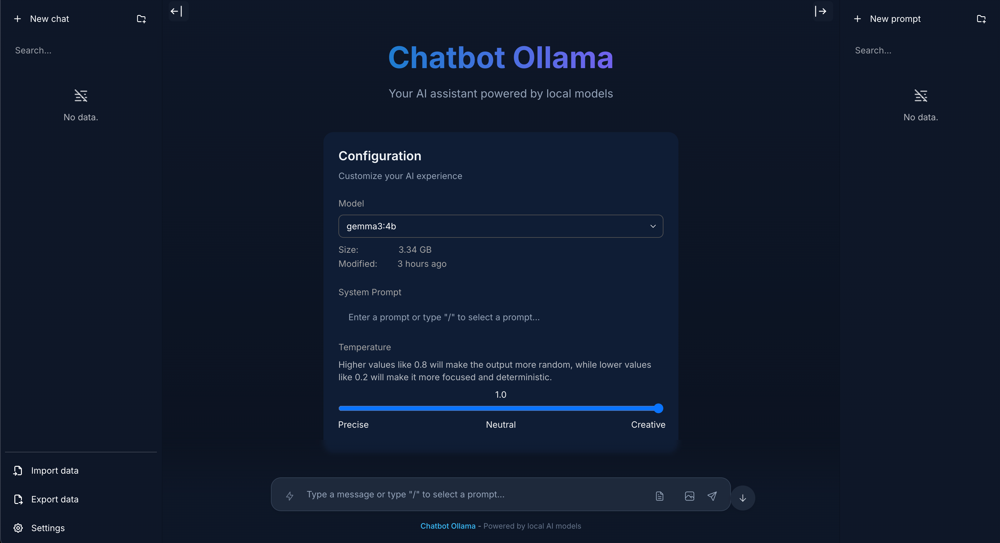
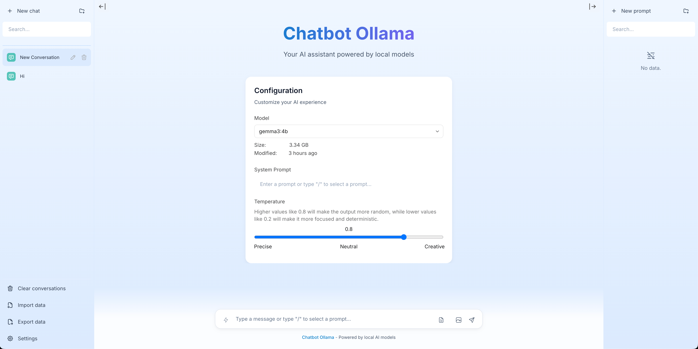

# Chatbot Ollama

## About

Chatbot Ollama is an open source chat UI for Ollama.

This project is based on [chatbot-ui](https://github.com/mckaywrigley/chatbot-ui) by [Mckay Wrigley](https://github.com/mckaywrigley).





> If the image does not render, place the new screenshot at `public/screenshots/screenshot-2025-09-dark.png` (light version optional at `public/screenshots/screenshot-2025-09-light.png`).

## Highlights (new)

- Blue theme polished for light and dark modes with consistent sidebars, headers, and overlays.
- Document upload (PDF, TXT, MD):
  - PDFs parsed server‑side for reliability; text/markdown read client‑side.
  - The full (truncated) content is attached invisibly to the model prompt — the UI stays clean.
  - 50 MB size cap, 100 page cap (PDF), 50k characters per attachment.
- Image upload: attach images and send them to vision‑capable models (base64). Non‑vision models simply ignore images.
- Code blocks: copy button, language label, optional line numbers, line‑wrap toggle, and “download as file”.
- Streaming & control: Stop Generation button, auto‑scroll toggle (pause/resume when you scroll up).
- Keyboard shortcuts:
  - Enter to send, Shift+Enter for newline
  - Esc to blur input
  - Ctrl/Cmd+L clears the composer
  - Arrow Up recalls the last user message
- Error handling: a consistent toast shows details, Copy details, and Retry.
- Conversation tools: Copy messages button copies the whole visible conversation (with role labels and any attached content).
- Sidebar UX: search inputs are theme‑aware, prompts list matches chat list styling, improved hover/selection.

## Updates

Chatbot Ollama will be updated over time.

### Next up

- [ ] Model management (pull/delete)
- [ ] Model info/details dialog

## Docker

Build locally:

```shell
docker build -t chatbot-ollama .
docker run -p 3000:3000 chatbot-ollama
```

Pull from ghcr:

```bash
docker run -p 3000:3000 ghcr.io/ivanfioravanti/chatbot-ollama:main
```

## Running Locally

### 1. Clone Repo

```bash
git clone https://github.com/ivanfioravanti/chatbot-ollama.git
```

### 2. Move to folder

```bash
cd chatbot-ollama
```

### 3. Install Dependencies

```bash
npm ci
```

### 4. Run Ollama server

Either via the cli:

```bash
ollama serve
```

or via the [desktop client](https://ollama.ai/download)

### 5. Run App

```bash
npm run dev
```

### 6. Use It

You should be able to start chatting.

### Tips

- Attach documents via the paper icon in the composer — the content is included for the model invisibly so the chat stays uncluttered.
- Attach an image with the camera icon — vision models will “see” it; others will ignore it.
- Use the clipboard icon in the sticky header to copy the current conversation.

## Configuration

When deploying the application, the following environment variables can be set:

| Environment Variable              | Default value                  | Description                                                                                                                               |
| --------------------------------- | ------------------------------ | ----------------------------------------------------------------------------------------------------------------------------------------- |
| DEFAULT_MODEL                     | `mistral:latest`                | The default model to use on new conversations                                                                                             |
| NEXT_PUBLIC_DEFAULT_SYSTEM_PROMPT | [see here](utils/app/const.ts) | The default system prompt to use on new conversations                                                                                     |
| NEXT_PUBLIC_DEFAULT_TEMPERATURE   | 1                              | The default temperature to use on new conversations                                                                                       |

## Contact

If you have any questions, feel free to reach out to me on [X](https://x.com/ivanfioravanti).
